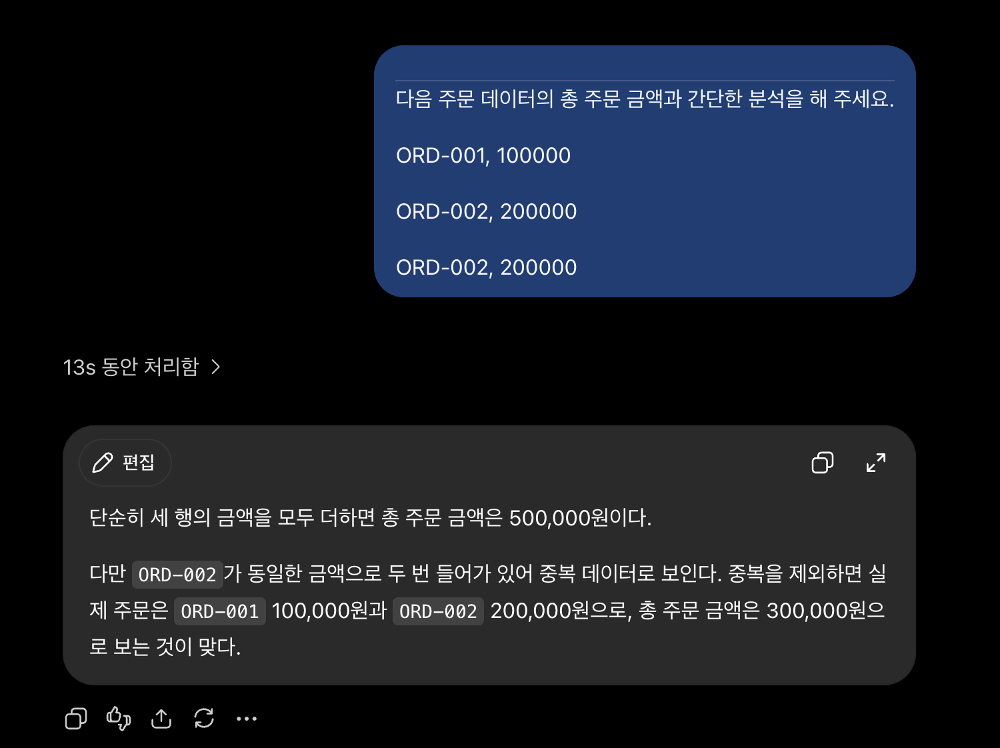

# STEP 1 
## 1. 실행 도구 확인
#### 실행 버전: PostgreSQL 18.6 on aarch64-apple-darwin24.6.0, compiled by Apple clang version 17.0.0 (clang-1700.0.13.5), 64-bit
#### 현재 접속한 데이터베이스: postgres
#### 현재 사용자: postgres
#### 현재 시각: 2026-09-07 19:31:54.390 +0900

##### (step1) 맥북이라서 처음에 터미널 사용이 어려웠지만 결국 실행했을 때 굉장히 뿌듯했습니다. 개인적으로는 사진을 첨부하는 것이 가장 신기했는데, 단순 코드와 문자를 통해서 복사 붙여넣기가 아니라 이미지를 불러온다는 점에서 굉장히 새로웠습니다.

# STEP 2
#### AI가 SQL을 만들어도 DB를 배워야 하는 이유: AI가 만든 양식, 코드가 항상 맞는 것은 아니다. 내가 원하는 데이터를 제대로 조회하는지 판단하고 수정하려면 DB 기본 개념을 알아야 한다.
#### SQL 결과를 검증해야 하는 이유: SQL이 실행되었다고 해서 결과가 항상 맞는 것은 아니기 때문에, 조건이나 데이터가 의도와 맞는지 직접 확인해야 한다.
#### 데이터 품질이 AI 답변 품질에 영향을 주는 이유: AI가 분석하는 데이터에 오류나 누락이 있으면 그 결과도 신뢰하기 어렵게 된다.

# STEP 3

## STEP 3-4
### AI가 만든 것처럼 실행
### 결과: student_count = 3

#### 학생 C가 왜 사라졌는가?/학생 A가 왜 두 번 나타났는가? -> 위에서 질문을 등록할 때 student_id가 1,1,2로 C는 등록되지 않았으므로 C는 누락되고 두번 질문한 A는 두번 나타났다. 
#### COUNT(*)가 실제로 무엇을 세고 있었는가? -> 질문을 카운트
#### 결과가 우연히 3이라도 왜 믿으면 안 되는가? -> 우연이 3이라고 하더라도 우리가 의도하던 학생 수를 센 것이 아니라 질문 수를 센 것이다. 만약, 학생이 한명 추가되었는데 질문을 하지 않았다면 앞으로 오류가 발생하기 때문이다.

## STEP 3-5: 데이터 변경
#### 실제 학생 수는 3명임에도 불구하고 시행 결과는 4로 나온다. 

## STEP 3-6
#### ai가 제시한 코드는 질문을 세고 있지만, 단순한 코드는 그냥 바로 학생만 세고 있다. 단순한 코드느 단순하게 students에서만 count하고 있는 반면, ai가 추천하는 코드는 오히려 복잡하게 각각에서 s,q에 할당하여 코드가 코인 편이다.
#### 3-8 증거 화면 저장

# STEP 4
## 4-2. 정상이라고 생각
#### (예상 답안) 300,000 (실제 결과) 500,000

## 4-3. AI에게 분석
#### (AI 답변) 단순히 세 행의 금액을 모두 더하면 총 주문 금액은 500,000원이다. 다만 ORD-002가 동일한 금액으로 두 번 들어가 있어 중복 데이터로 보인다. 중복을 제외하면 실제 주문은 ORD-001 100,000원과 ORD-002 200,000원으로, 총 주문 금액은 300,000원으로 보는 것이 맞다.
#### (나의 분석) AI가 중복 가능성을 언급하긴 했으나, 실제로 다른 주문인지, 같은 주문인지 바로 알아차리지 못한다.

# STEP 5 
### A. 개인 독서 기록: 파일 / 복잡한 관계나 권한이 필요하지 않고, 데이터양이 적고, 짧은 메모만 기록하기 때문에 / 사람 수가 증가하거나 읽는 책 수가 증가하는 경우. 복잡한 관계가 필요해지는 경우
### B. 동아리 행사 신청 명단: 스프레드시트 / 2-3명의 권한이 필요하고, 이름이나 연락처 등 개인 정보가 포함됨. 메모가 아니라 Y/N라는 참석여부이기 때문에 / 복잡한 관계가 필요해지는 경우, 단순 참석여부가 아니라 사람과의 관계, 알러지 등의 메모가 포함되는 경우
### C. 온라인 강의 서비스: DBMS / 복잡하고 학생화 강의가 변화하며 일대일 관계가 아니다. 권한과 복구가 중요하기 때문이다. / 한 학생이 한 강의만 신청할 수 있는 경우.

# STEP 6
### 1)이름: 경영대 우산 대여 서비스 자동화 2)목적: 현재 운영 중인 서울대 경영대 학생회 우산 대여 서비스를 자동적으로 관리하는 프로그램 제작.
#### 관리할 데이터: 이름/학번/우산번호/대여날짜/연체여부
#### 한행의 의미: 학생 데이터 한 행 = 학생 한 명, 우산 데이터 한 행 = 우산 한 개, 연체여부 한 행 = 특정 학생이 특정 우산을 연체했는지 여부
#### 관계: 한 학생은 하나의 우산만 대여 가능하다, 하나의 우산은 하나의 학생만 대여 가능하다, 하나의 대여는 한 학생과 한 우산을 연결한다.
#### 질문: (1)우산이 추가적으로 구매하는가? (2)우산의 반납 기한은 얼마인가? (3)반납하면 데이터를 삭제할 것인가?

#### 1)반납 날짜 데이터 포함: 수용 (반납 날짜가 있어야 연체 여부 판단 가능)
#### 2)우산 대여 상태 포함: 거절 (상태는 대부분 좋아서 굳이 할 필요 없이, 만약 안 좋은 경우에는 서비스 포함 안될테니까)
#### 3)스프레드 시트 활용: 거절 (최근 학생들의 대여가 활발해지고 있어서)
#### 4)연체 학생에게 안내를 보내야 할까?: 수용 (연체 안내를 해야 원활하게 서비스 운영 간으)
#### 5)반납하지 않은 상태에서 다시 대여하려는 학생은 막을까?: 수용 (일정 기한동안 데이터에 두고 대여 금지)

#### 답변 차이: 프롬포를 바꾸니까 확실히 맘대로 가정하고 생각하는 부분이 없어짐.

# STEP 8: 구분
#### 반납 날짜 및 대여 날짜: 연체 여부 판단을 위한 원본 데이터
#### 연체 학생에 대한 대여 일시정지 -> 연체 여부가 만든 파생 데이터
#### AI가 작성한 인기 대여 시간 -> 데이터와 지시로 만들어지는 결과
#### 기준 데이터가 바뀌면 파생 데이터 역시 변경해야 한다. AI가 결과만 남고, 데이터가 없다면 충분히 검증할 수 있다. 그러한 결과값이 나온 이유과 과정을 모르기 때문이다.

