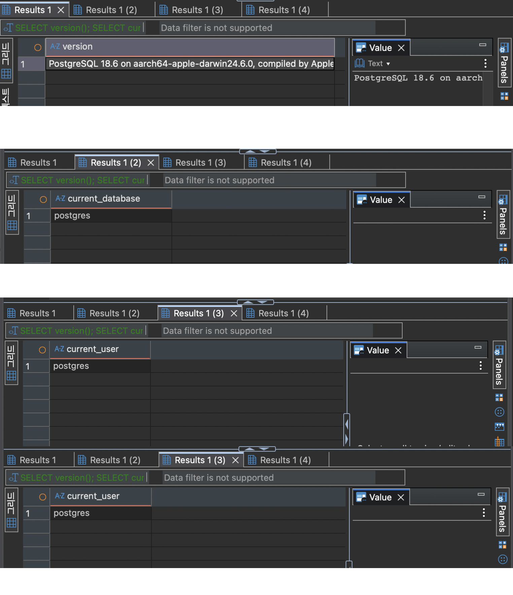
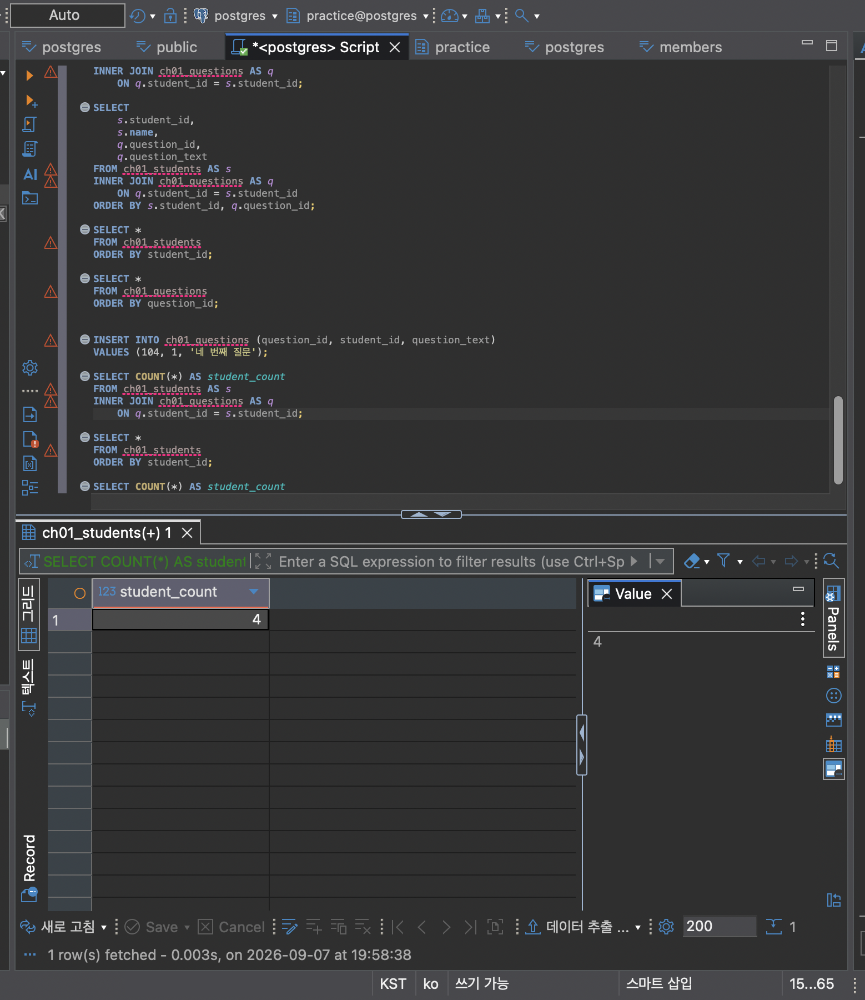

# STEP 1 
## 1. 실행 도구 확인
#### 실행 버전: PostgreSQL 18.6 on aarch64-apple-darwin24.6.0, compiled by Apple clang version 17.0.0 (clang-1700.0.13.5), 64-bit
#### 현재 접속한 데이터베이스: postgres
#### 현재 사용자: postgres
#### 현재 시각: 2026-09-07 19:31:54.390 +0900

##### (step1) 맥북이라서 처음에 터미널 사용이 어려웠지만 결국 실행했을 때 굉장히 뿌듯했습니다. 개인적으로는 사진을 첨부하는 것이 가장 신기했는데, 단순 코드와 문자를 통해서 복사 붙여넣기가 아니라 이미지를 불러온다는 점에서 굉장히 새로웠습니다.

# STEP 2
#### AI가 SQL을 만들어도 DB를 배워야 하는 이유: AI가 만든 양식, 코드가 항상 맞는 것은 아니다. 내가 원하는 데이터를 제대로 조회하는지 판단하고 수정하려면 DB 기본 개념을 알아야 한다.
#### SQL 결과를 검증해야 하는 이유: SQL이 실행되었다고 해서 결과가 항상 맞는 것은 아니기 때문에, 조건이나 데이터가 의도와 맞는지 직접 확인해야 한다.
#### 데이터 품질이 AI 답변 품질에 영향을 주는 이유: AI가 분석하는 데이터에 오류나 누락이 있으면 그 결과도 신뢰하기 어렵게 된다.

# STEP 3-4
### AI가 만든 것처럼 실행
### 결과: student_count = 3

#### 학생 C가 왜 사라졌는가?/학생 A가 왜 두 번 나타났는가? -> 위에서 질문을 등록할 때 student_id가 1,1,2로 C는 등록되지 않았으므로 C는 누락되고 두번 질문한 A는 두번 나타났다. 
#### COUNT(*)가 실제로 무엇을 세고 있었는가? -> 질문을 카운트
#### 결과가 우연히 3이라도 왜 믿으면 안 되는가? -> 우연이 3이라고 하더라도 우리가 의도하던 학생 수를 센 것이 아니라 질문 수를 센 것이다. 만약, 학생이 한명 추가되었는데 질문을 하지 않았다면 앞으로 오류가 발생하기 때문이다.

# STEP 3-5: 데이터 변경
#### 실제 학생 수는 3명임에도 불구하고 시행 결과는 4로 나온다. 

# STEP 3-6
#### ai가 제시한 코드는 질문을 세고 있지만, 단순한 코드는 그냥 바로 학생만 세고 있다. 단순한 코드느 단순하게 students에서만 count하고 있는 반면, ai가 추천하는 코드는 오히려 복잡하게 각각에서 s,q에 할당하여 코드가 코인 편이다.
#### 3-8 증거 화면 저장

