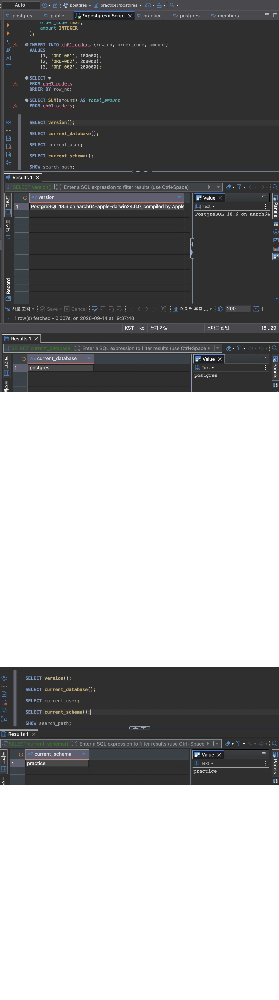
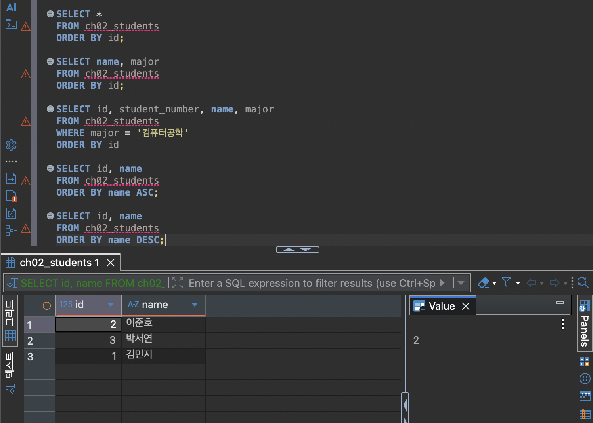
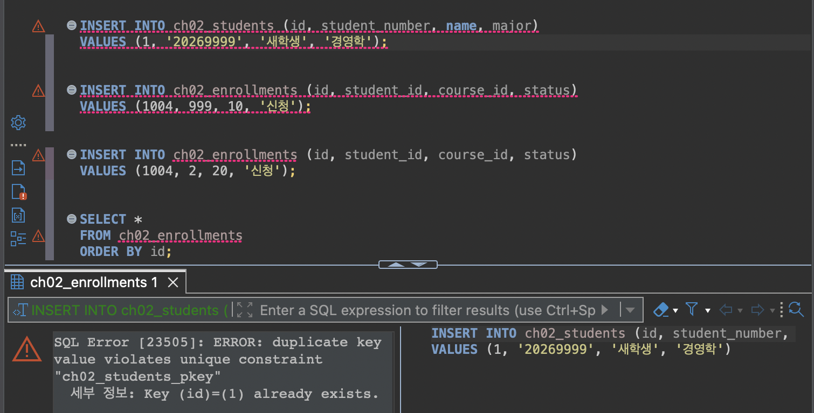
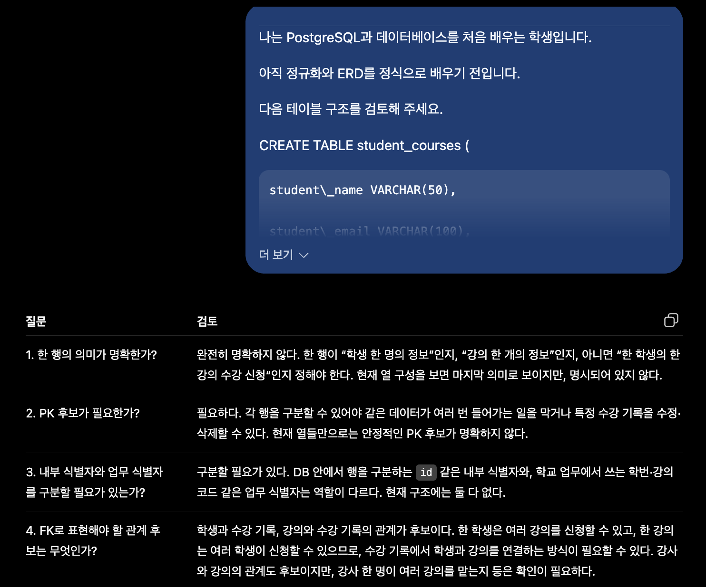

# Chapter 02 확장 실습 답안

> **과제:** 데이터와 DBMS의 기본 개념  
> **사용 방법:** 이 파일을 내려받아 본인의 GitHub 저장소에 `chapter02_answer.md`라는 이름으로 저장한 뒤 실습하면서 바로 작성합니다.  
> **제출 방법:** LMS에는 파일을 직접 업로드하지 않고, **본인 GitHub 저장소의 `chapter02_answer.md` 파일 URL**을 제출합니다.

---

## 제출 전 개인정보 주의

LMS에서 제출자를 확인할 수 있으므로 이 공개 Markdown 파일에 학번이나 실명을 반드시 적을 필요는 없습니다.

```text
GitHub 계정 또는 별칭: seohee0233
과제 작성일: 2026-09-14
사용한 AI 도구: chatgpt
```

> 실제 비밀번호, API Key, 전체 DB 접속 URL, 개인정보가 포함된 화면은 올리지 않습니다.

---

# 1. PostgreSQL에서 현재 위치 확인

## 1-1. 실행한 SQL

```sql
SELECT version();
SELECT current_database();
SELECT current_user;
SELECT current_schema();
SHOW search_path;
```

## 1-2. 실행 결과 기록

```text
PostgreSQL 버전: 18.6(apple)
현재 데이터베이스: postgres
현재 사용자: postgres
현재 스키마: practice
search_path: practice, "$user", public
```

## 1-3. 구조를 내 말로 설명

```text
PostgreSQL은: 데이터를 저장하고 분석하는 프로그램

현재 접속한 데이터베이스는: postgres이며, 데이터 베이스란 가장 큰 저장 공간의 이름이다.

스키마는: practice로 데이터베이스 안의 폴더 같은 공간이다.

DBeaver 또는 psql 같은 도구는: PostgreSQL에 접속해서 SQL 문장을 입력하고 실행할 수 있게 해 주는 프로그램이다.
```

## 1-4. 계층 구조 완성

```text
사용자
→ DBeaver
→ PostgreSQL DBMS
→ 데이터베이스
→ 스키마
→ 테이블
→ 행 / 열
```

## 1-5. 증거 화면

권장 경로:

```text
assignments/chapter02/images/step01_environment.png
```

```markdown

```


---

# 2. 데이터베이스 안의 스키마와 테이블 관찰

## 2-1. 스키마 조회 결과

실행한 SQL:

```sql
SELECT schema_name
FROM information_schema.schemata
ORDER BY schema_name;
```

관찰한 스키마 이름 중 3개 이내를 적습니다.

```text
1.public
2.pg_toast
3.pg_catalog
```

### `public`은 무엇인가요?

```text
나의 설명: public은 PostgreSQL에서 기본으로 만들어져 있는 스키마이다. 따로 스키마 이름을 정하지 않고 테이블을 만들면 보통 public 스키마에 저장된다. 다만 저번에 배운 것처럼 기본 설정을 바꾸면 된다.
```

### 데이터베이스와 스키마는 같은 것인가요?

```text
나의 설명: 다르다. 데이터베이스는 큰 저장 공간이고, 스키마는 그 안에서 테이블을 정리하는 폴더 같은 공간이다.
```

## 2-2. 현재 보이는 테이블 조회

```sql
SELECT table_schema, table_name
FROM information_schema.tables
WHERE table_type = 'BASE TABLE'
  AND table_schema NOT IN ('pg_catalog', 'information_schema')
ORDER BY table_schema, table_name;
```

```text
조회된 사용자 테이블 수 또는 눈에 띈 테이블: 1개 members 테이블로, 저번 실습에서 만들어둔 것이다. 

아직 테이블이 거의 없어도 괜찮은 이유: 아직 수업에서 배우지 않아서 테이블을 거의 만들지 않았을 수도 있기 때문이다.
```

## 2-3. 관찰 정리

```text
PostgreSQL 서버 안에는 여러 데이터베이스가 있을 수 있다.
한 데이터베이스 안에는 여러 스키마가 있을 수 있다.
스키마 안에는 테이블과 같은 객체가 존재한다.
```

---

# 3. TEMP TABLE로 테이블·행·열·키 직접 확인

## 3-1. 임시 테이블 생성 완료 확인

- [ ] `ch02_students` 생성
- [ ] `ch02_courses` 생성
- [ ] `ch02_enrollments` 생성

각 테이블의 **한 행 의미**를 적습니다.

| 테이블 | 한 행의 의미 |
| --- | --- |
| `ch02_students` | 학생 한 명 |
| `ch02_courses` | 강의 한 개 |
| `ch02_enrollments` | 특정 학생이 특정 강의를 신청한 사건 한 건 |

## 3-2. 열의 의미 확인

### `ch02_students`

| 열 | 값의 의미 | 내부 식별자 / 업무 식별자 / 일반 속성 |
| --- | --- | --- |
| `id` | DB 내부에서 학생 행을 구분하는 내부 식별자 후보 | 내부 식별자 |
| `student_number` | 학교 업무에서 사용하는 업무 식별자 후보 | 업무 식별자 |
| `name` | 학생 이름 | 일반 속성 |
| `major` | 전공 | 일반 속성 |

### `ch02_enrollments`

| 열 | 값의 의미 | PK / FK / 일반 속성 |
| --- | --- | --- |
| `id` | 수강 신청 행을 구분하는 번호 | PK |
| `student_id` | 수강 신청한 학생의 id  | FK |
| `course_id` | 신청한 과목의 id | FK |
| `status` | 수강 신청 상태 | 일반속성 |

## 3-3. 입력된 행 수

```text
students 행 수: 3
courses 행 수: 2
enrollments 행 수: 3
```

## 3-4. 내부 식별자와 업무 식별자

```text
students.id가 필요한 이유: 데이터 베이스 내에서 확실하게 구분하고 다른 것과 연결하기 위해서.

student_number가 필요한 이유: 학교에서 실제 학생들을 구분하는데에 사용하는 번호이다.

둘을 항상 같은 값으로 사용하지 않아도 되는 이유: id는 데이터베이스에서 관리하는 번호이고, student_number는 학교 업무에서 사용하는 학번이라 역할이 다르기 때문이다.
```

## 3-5. 숫자처럼 보이는 학번을 문자열로 저장한 이유

```text
나의 설명: 앞에 00이 빠지는걸 방지하고 계산 등의 수식을 방지하기 위해서
```

---

# 4. 테이블과 조회 결과는 다르다

## 4-1. 원본 테이블 행 수

```text
ch02_students 전체 행 수: 3
```

## 4-2. 일부 열만 조회

실행 SQL:

```sql
SELECT name, major
FROM ch02_students
ORDER BY id;
```

```text
원본 테이블의 열 수와 조회 결과의 열 수가 다른 이유: 두번째 실행에서는 이름, 전공만 선택해서 시행했기 때문에
```

## 4-3. 조건을 적용한 조회

실행 SQL:

```sql
SELECT id, student_number, name, major
FROM ch02_students
WHERE major = '컴퓨터공학'
ORDER BY id;
```

```text
원본 테이블 행 수: 3
조회 결과 행 수: 2
원본 테이블의 데이터가 삭제된 것인가?: No
그렇게 판단한 이유: 컴퓨터 공학 전공만 선택해서 불러왔기 때문에 삭제한게 아니라 선택해서 보여준 것이다.
```

## 4-4. 정렬 결과 비교

```sql
SELECT id, name
FROM ch02_students
ORDER BY name ASC;

SELECT id, name
FROM ch02_students
ORDER BY name DESC;
```

```text
ASC 결과의 첫 학생: 김민지
DESC 결과의 첫 학생: 이준호

이 실험을 통해 ORDER BY에 대해 알게 된 점: ASC는 한글이어도 가나다 순으로 정렬되고 DESC는 반대로 정렬된다.
```

## 4-5. 증거 화면

권장 경로:

```text
assignments/chapter02/images/step04_result_set.png
```



---

# 5. PK와 FK를 실제로 관찰

## 5-1. 정상 데이터의 관계 읽기

다음 SQL 결과를 보고 작성합니다.

```sql
SELECT
    e.id AS enrollment_id,
    s.name AS student_name,
    c.title AS course_title,
    e.status
FROM ch02_enrollments AS e
JOIN ch02_students AS s
    ON s.id = e.student_id
JOIN ch02_courses AS c
    ON c.id = e.course_id
ORDER BY e.id;
```

```text
한 행이 의미하는 것: 수강신청을 시행한 사건 하나

같은 student_id가 여러 enrollment 행에서 반복될 수 있는 이유: 한 명의 여러 개의 강의를 수강할 수 있기 때문에

같은 course_id가 여러 enrollment 행에서 반복될 수 있는 이유: 같은 과목에 여러 명이 수강신청할 수 있기 때문에
```

## 5-2. 기본키 중복 오류 관찰

중복 PK 입력을 시도한 결과:

```text
실행 성공 / 실패: 실패
오류 메시지에서 확인한 핵심 단어: unique
왜 실패했다고 생각하는가: id=1은 고유한 값인데 이미 다른 사람이 사용하고 있어서
```

## 5-3. 존재하지 않는 학생을 참조하는 FK 오류 관찰

존재하지 않는 `student_id`를 사용한 수강신청 입력 결과: 실패

```text
실행 성공 / 실패: 실패
오류 메시지에서 확인한 핵심 단어: not exist
왜 실패했다고 생각하는가: 존재하지 않는 id를 사용했기 때문에 사람을 찾을 수 없어서
```

## 5-4. PK와 FK의 차이 정리

```text
PK는 테이블의 각 행을 서로 구분하기 위한 키이다.

FK는 다른 테이블의 행과 연결하기 위한 키이다.

FK 값이 여러 행에서 반복될 수 있는 이유는
한 학생이 여러 과목을 신청하거나 한 과목을 여러 학생이 신청할 수 있기 때문이다.
```

## 5-5. 증거 화면

권장 경로:

```text
assignments/chapter02/images/step05_pk_fk.png
```

> 오류 메시지는 전체 화면이 아니라 테이블명·constraint·참조 오류가 보이는 정도만 캡처합니다.



---

# 6. 관계와 카디널리티를 자연어로 설명

현재 임시 데이터 기준으로 작성합니다.

```text
학생 한 명은 여러 수강신청을 가질 수 있는가?: Y

강의 한 개는 여러 수강신청을 가질 수 있는가?: Y

수강신청 한 건은 학생 몇 명을 참조하는가?: 1명

수강신청 한 건은 강의 몇 개를 참조하는가?: 1개
```

아래 구조를 완성합니다.

```text
students 1 ── N enrollments N ── 1 courses
```

### 학생과 강의가 N:M 관계라고 볼 수 있는 이유

```text
나의 설명: 한 학생은 여러 강의를 수강 신청할 수 있고, 한 강의도 여러 학생이 수강 신청할 수 있기 때문이다. 따라서 학생과 강의는 여러 명과 여러 개가 연결되는 N:M 관계이다.
```

> 아직 0개 허용 여부, 필수 관계, 삭제 정책까지 확정하지 않습니다. 그런 규칙은 Chapter 05~06에서 다룹니다.

---

# 7. AI가 만든 테이블 구조 직접 검토

## 7-1. AI에게 묻기 전에 내가 먼저 찾은 문제

다음 구조를 보고 최소 4개를 적습니다.

```sql
CREATE TABLE student_courses (
    student_name VARCHAR(50),
    student_email VARCHAR(100),
    course_title VARCHAR(100),
    instructor_name VARCHAR(50)
);
```

```text
문제 1. 한 행이 학생인지 강의인지 수강 신청인지 명확하지 않다.
문제 2. PK가 없어서 확실한 구분이 어렵다.
문제 3. 학생, 강사, 강의가 모두 문자열이라서 연결이 어렵다.
문제 4. 다른 테이블과 어떻게 연결되는지가 없다. 

```

## 7-2. AI 검토 요청 프롬프트

사용한 핵심 프롬프트를 기록합니다.

```text
다음 테이블 구조를 검토해 주세요.

```

## 7-3. AI 제안과 나의 판단

| AI의 지적 또는 제안 | 동의 / 수정 / 보류 | 나의 근거 |
| --- | --- | --- |
| 한 행의 의미를 명확히 정할 필요가 있다. | 동의 | 현재 명확하지 않아서 헷갈림 |
| 각 행을 구분할 PK 후보가 필요하다. | 동의 | 동명이인, 동일한 강의명 구분 |
| 내부 식별자와 업무 식별자를 구분할 필요가 있다. | 보류 | 하면 좋지만 필수적이지는 않은 것 같음 |
| 학생과 수강 기록, 강의와 수강 기록의 관계를 FK로 표현할 수 있다. | 동의 | 서로 N-N 관계를 가지니까 |

## 7-4. 본문과 대조한 항목

AI 설명 중 최소 하나를 `chapter02.md`와 비교합니다.

```text
AI가 설명한 내용:

본문에서 확인한 내용:

일치 / 부분 일치 / 수정 필요:

내가 최종적으로 이해한 내용:
```

## 7-5. 증거 화면

권장 경로:

```text
assignments/chapter02/images/step07_ai_review.png
```



---

# 8. Chapter 01의 개인 서비스 아이디어를 DB 용어로 다시 표현

Chapter 01에서 정한 개인 서비스 주제를 그대로 사용하거나 새 주제를 정해도 됩니다.

## 8-1. 서비스 기본 정보

```text
서비스 이름: 경영대 우산 대여 서비스
서비스 목적: 학생회에서 운영하는 우산 대여 서비스를 데이터베이스로 관리하여, 누가 어떤 우산을 빌렸는지와 반납·연체 여부를 쉽게 확인하기 위함이다.
```

## 8-2. PostgreSQL 구조 후보

```text
데이터베이스 이름 후보: cba_umbrella
스키마 이름 후보: practice
```

> 아직 실제 데이터베이스나 스키마를 생성하지 않아도 됩니다.

## 8-3. 테이블 후보와 한 행 의미

최소 3개를 작성합니다.

| 테이블 후보 | 한 행의 의미 | 내부 ID 후보 | 업무 식별자 후보 |
| --- | --- | --- | --- |
| students | 학생 한 명 | student_id | 학번 |
| umbrellas | 대여 우산 한 개 |  umbrella_id | 1~10 |
| rentals | 빌리는 행위 한 사건 | rental_id | - |

## 8-4. FK 후보

```text
1. rentals.student_id → students.student_id
   이유: 각 대여 기록이 어떤 학생의 대여인지 알기 위해 연결한다.

2. rentals.umbrella_id → umbrellas.umbrella_id
   이유: 각 대여 기록이 어떤 우산의 대여인지 알기 위해 연결한다.
```

## 8-5. 자연어 관계 문장

```text
1. 한 학생은 여러 번 우산을 대여할 수 있다. (반납시에만)
2. 하나의 우산은 여러 번 대여될 수 있다.
3. 하나의 대여 기록은 한 학생과 한 우산을 연결한다.
```

## 8-6. 아직 확정하지 않을 정책

```text
Q1. 학생이 연체 중일 때 얼마의 기간동안 대여를 중지할 것인가?
Q2. 우산을 분실하거나 파손했을 때 어떻게 중단할 것인가?
Q3. 한 학생이 같은 날 반납 후 다시 빌리는 것을 허용할 것인가?

```

---

# 9. AI를 개인 구조의 검토자로 사용

## 9-1. 사용한 프롬프트

```text
나는 데이터베이스를 처음 배우는 학생입니다. 경영대 우산 대여 서비스를 관리하는 데이터베이스를 만들고 싶습니다.

관리할 데이터는 학생 이름과 학번, 우산 번호, 대여 날짜, 반납 여부, 연체 여부입니다.

학생, 우산, 대여 기록 테이블 후보를 생각했습니다. 완성된 설계를 바로 만들지 말고, 각 테이블의 한 행 의미, PK 후보, FK 후보, 중복 저장 위험, 아직 결정할 수 없는 정책을 중심으로 검토해 주세요.
```

## 9-2. AI가 질문한 내용 중 유용했던 것

```text
1. 대여 기록 한 행이 정확히 무엇을 의미하는지 먼저 정해야 한다는 점이 유용했다.
2. 학생 정보와 우산 정보가 대여 기록에 반복해서 저장될 수 있다는 점이 유용했다.
3. 연체 중인 학생의 추가 대여 가능 여부처럼 아직 정하지 않은 정책을 따로 기록해야 한다는 점이 유용했다.
```

## 9-3. AI가 너무 빨리 결정한 내용 또는 내가 보류한 내용

```text
1. 우산 분실·파손 상태를 별도 테이블로 관리할지는 현재 요구사항만으로 결정하기 어려워 보류했다.
```

## 9-4. 검토 후 수정한 구조

| 수정 전 | 수정 후 | 수정 이유 |
| --- | --- | --- |
| 우산 번호 하나만 사용 | 내부 구분 번호와 외부 연결 번호 두 개 모두 사용 | 다른 데이터베이스와 연결을 위하여 |
| 대여 날짜·반납 여부만 기록 | rental_id를 가진 rentals 테이블로 관리 | 쉽게 정리하기 위해서 |
---

# 10. 최종 개념 정리

아래 문장을 본인의 말로 완성합니다.

```text
PostgreSQL은 데이터를 표 형태로 저장하고 SQL로 관리하는 데이터베이스 프로그램이다.

DBeaver 또는 psql은 PostgreSQL에 접속해서 SQL을 입력하고 실행하는 도구이다.

데이터베이스와 스키마의 차이는 데이터베이스는 큰 저장 공간이고, 스키마는 그 안에서 테이블을 정리하는 공간이라는 점이다.

테이블 한 행은 하나의 대상이나 하나의 사건에 대한 기록이다.

조회 결과가 원본 테이블과 다른 이유는 SELECT 문에서 원하는 열이나 행만 골라서 볼 수 있기 때문이다.

내부 식별자와 업무 식별자의 차이는 내부 식별자는 DB 안에서 행을 구분하는 번호이고, 업무 식별자는 실제 업무에서 대상을 구분하는 번호라는 점이다.

PK는 테이블의 각 행을 서로 구분하기 위한 키이다.

FK는 다른 테이블의 행과 연결하기 위한 키이다.
```

---

# 11. 이번 Chapter에서 새롭게 알게 된 점

최소 3개를 작성합니다.

```text
1. PK와 FK라는 용어 자체
2. Pk와 FK의 차이점, 특히 테이블 내에서 구분하는 것인지 밖과 연결하는 것인지
3. 데이터베이스와 스키마의 차이
```

## 아직 헷갈리는 내용

```text
1. 내부 식별자와 업무 식별자를 실제 서비스에서 언제 둘 다 만들어야 하는지
```

## AI에게 다시 질문하고 싶은 내용

```text
내부 식별자와 업무 식별자를 실제 서비스에서 언제 둘 다 만들어야 하나요?
```

---

# 12. 제출 전 자기 점검

- [V] PostgreSQL에서 현재 database / schema / search_path를 확인했다.
- [V] DBMS, database, schema, table을 구분해서 설명할 수 있다.
- [V] TEMP TABLE 3개를 생성하고 직접 데이터를 조회했다.
- [V] 각 테이블의 한 행 의미를 작성했다.
- [V] 테이블과 조회 결과가 다르다는 것을 실제 SQL로 확인했다.
- [V] `ORDER BY`를 사용하지 않으면 업무 순서를 가정하면 안 된다는 점을 이해했다.
- [V] 내부 식별자와 업무 식별자의 차이를 설명할 수 있다.
- [V] PK 중복 입력 실패를 직접 확인했다.
- [V] 존재하지 않는 FK 참조 실패를 직접 확인했다.
- [V] FK 값이 반복될 수 있는 이유를 설명할 수 있다.
- [V] AI가 만든 테이블을 내가 먼저 검토했다.
- [V] AI 설명 중 최소 하나를 본문과 대조했다.
- [V] 개인 서비스의 테이블 후보를 3개 이상 작성했다.
- [V] 개인 서비스의 FK 후보와 미확정 정책을 기록했다.
- [V] 실제 비밀번호·API Key·민감한 접속 정보가 포함되지 않았는지 확인했다.
- [V] 이미지 링크가 GitHub에서 정상적으로 보이는지 확인했다.

---

# 13. GitHub 제출 정보

답안 파일 권장 위치:

```text
assignments/chapter02/chapter02_answer.md
```

이미지 권장 위치:

```text
assignments/chapter02/images/
```

LMS 제출 URL 형식:

```text
https://github.com/<본인-GitHub-ID>/<본인-저장소>/blob/main/assignments/chapter02/chapter02_answer.md
```

## 최종 확인

- [V] 위 URL을 로그아웃 상태 또는 다른 브라우저에서 열어도 확인 가능하다.
- [V] Markdown이 정상 렌더링된다.
- [V] 이미지가 깨지지 않는다.
- [V] LMS에 교수자 템플릿 URL이 아니라 **내 답안 파일 URL**을 제출했다.
