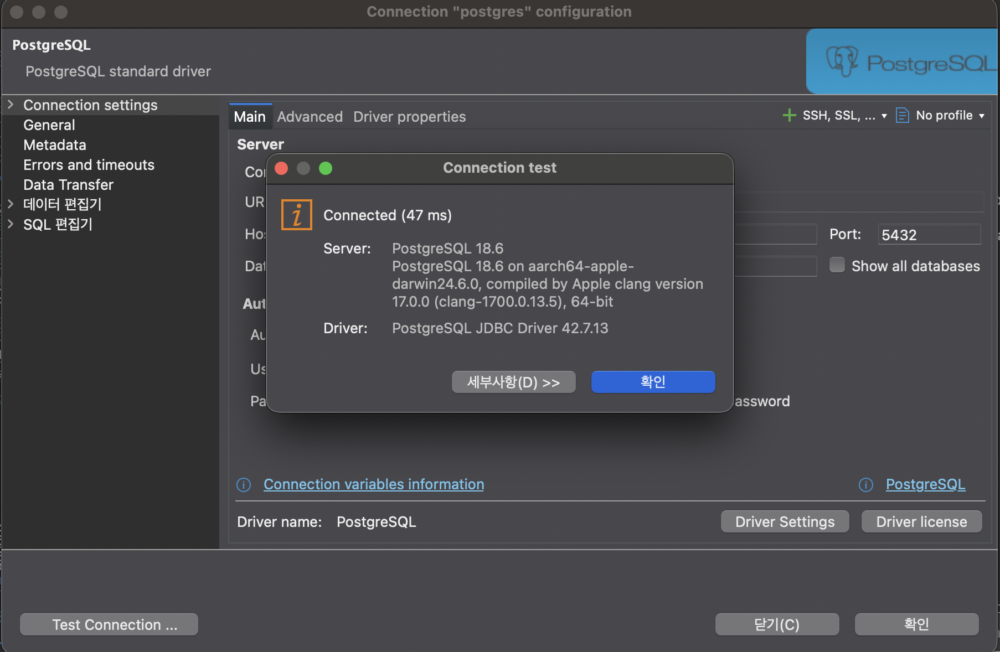
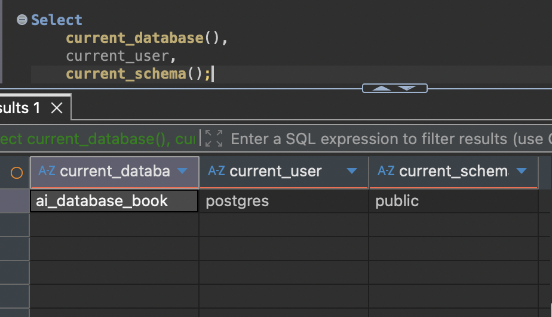
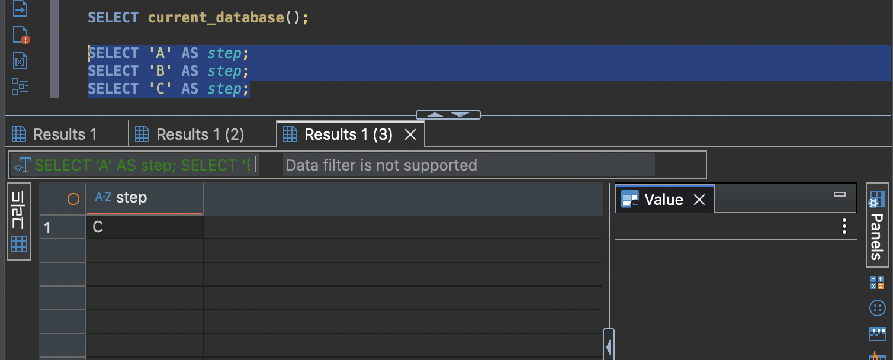

# Chapter 03 확장 실습 답안 템플릿

> **과제:** PostgreSQL과 DBeaver로 실습 환경 검증하기  
> **사용 방법:** 이 파일을 내려받아 본인의 GitHub 저장소에 `chapter03_answer.md`라는 이름으로 저장한 뒤 실습하면서 바로 작성합니다.  
> **제출 방법:** LMS에는 파일을 직접 업로드하지 않고, **본인 GitHub 저장소의 `chapter03_answer.md` 파일 URL**을 제출합니다.

---

## 제출 전 보안 주의

이 과제 파일과 캡처 화면에는 다음 정보를 올리지 않습니다.

```text
실제 PostgreSQL 비밀번호
전체 DB 접속 URL
API Key / Token
개인정보
공개할 필요가 없는 사내 서버 주소
```

LMS에서 제출자를 확인할 수 있으므로 공개 저장소의 답안 파일에 학번이나 실명을 반드시 적을 필요는 없습니다.

```text
GitHub 계정 또는 별칭: seohee0233
과제 작성일: 2026.09.22
사용한 AI 도구: Chat GPT
```

---

# 1. PostgreSQL과 DBeaver 환경 확인

## 1-1. 내 환경

| 항목 | 작성 내용 |
| --- | --- |
| 운영체제 | mac os |
| PostgreSQL 버전 | 18.6 |
| DBeaver 버전 |  |
| Host | 127.0.0.1 |
| Port | 5432 |
| Database | ai_database_book |
| Username | postgres |

> 비밀번호는 기록하지 않습니다.

## 1-2. PostgreSQL과 DBeaver 역할 설명

```text
PostgreSQL은: 데이터를 저장하거나 분석하는 프로그램

DBeaver는: SQL을 실행시켜주는 것

두 프로그램의 차이는:
```

---

# 2. 연결 테스트와 첫 SQL

## 2-1. DBeaver 연결 결과

- [v] PostgreSQL 연결 유형 선택
- [v] Host 확인
- [v] Port 확인
- [v] Database 확인
- [v] Username 확인
- [v] Test Connection 성공

### 연결 성공 화면

권장 이미지 경로:

```text
assignments/chapter03/images/step02_connection.png
```

`'
## 2-2. 첫 SQL 실행

```sql
SELECT 1 + 1 AS result;
```

실행 전 예상:

```text
2
```

실제 결과:

```text
2
```

이 결과가 의미하는 것:

```text
1+1의 값을 계산
```

---

# 3. 현재 연결 위치를 SQL로 검증

다음 SQL을 실행합니다.

```sql
SELECT version();
SELECT current_database();
SELECT current_user;
SELECT current_schema();
SHOW search_path;
SHOW transaction_read_only;
SHOW TimeZone;
```

## 3-1. 결과 기록

| 확인 항목 | 실제 결과 | 내가 이해한 의미 |
| --- | --- | --- |
| `version()` | 18.6 | sql 18.6 버전 사용중 |
| `current_database()` | ai_database_book | 현재 데이터베이스 ai_database_book 사용 |
| `current_user` | postgres | user 이름 postgres |
| `current_schema()` | public | 가장 일반적인 public 사용 |
| `search_path` | public, "$users" | public 스키마의 users를 통해 접속 |
| `transaction_read_only` | off | 읽기모드 꺼져 있음(편집 가능) |
| `TimeZone` | Asia/Seoul | 컴퓨터 시스템 시간대가 아시아>서울 시간대 사용 |

## 3-2. 반드시 설명할 것

### DBeaver 연결 이름과 `current_database()`는 왜 같은 개념이 아닌가요?

```text
DBeaver는 SQL 작성을 도와주는 프로그램이고, current_database()는 PostgreSQL 안의 실제 DB 이름이다.
```

### `current_schema()`와 `search_path`는 어떤 관계가 있나요?

```text
관련 있다. path는 스키마의 순서이므로 가장 기분이 되는 것이 current_schema()이다.
```

### `transaction_read_only = off`라는 결과만으로 모든 테이블을 만들 권한이 있다고 단정할 수 있나요?

```text
아니다. 모든 스키마와 테이블을 생성할 권한이 있다는 것과 같은 말이 아니다.
```

## 3-3. 증거 화면

권장 경로:

```text
assignments/chapter03/images/step03_location_check.png
```

`'

---

# 4. `ai_database_book` 데이터베이스 확인

## 4-1. 현재 데이터베이스

```sql
SELECT current_database();
```

실제 결과: 

```text
ai_database_book
```

- [v] 결과가 `ai_database_book`이다.
- [v] 다른 DB라면 올바른 연결로 전환했다.

## 4-2. 연결을 바꾼 뒤 다시 검증

```text
전환하지 않음. chapㅅer 03 수업에서 이미 전환 완료.
```

### 화면에서 보이는 연결 이름만 믿지 않고 SQL을 다시 실행해야 하는 이유

```text
이름만 변경되었을 수도 있기 때문이다.
```

---

# 5. SQL 실행 범위 실험

SQL Editor에 다음 세 문장을 입력합니다.

```sql
SELECT 'A' AS step;
SELECT 'B' AS step;
SELECT 'C' AS step;
```

## 5-1. 한 문장 실행

```text
내가 실행한 문장:SELECT 'A' AS step;
실제 결과: A
```

## 5-2. 선택 영역 실행

```text
선택한 문장:
SELECT 'A' AS step;
SELECT 'B' AS step;
실제 결과: A | B
```

## 5-3. 전체 스크립트 실행

```text
실제 결과:
결과 탭 또는 실행 순서에서 관찰한 점: 결과 탭이 여러개 생긴다
```

## 5-4. 결과 해석

```text
한 문장 실행과 전체 스크립트 실행의 차이: 한문장은 탭이 1개, 전체는 탭이 3개 생기며 마지막 줄을 기준으로 보여진다.

변경 SQL에서 실행 범위를 잘못 선택하면 위험한 이유: 탭이 여러개 생길 수 있으며 데이터 변경까지 생길 수 있음
```

### 증거 화면

권장 경로:

```text
assignments/chapter03/images/step05_execution_scope.png
```

`'
---

# 6. 제공된 환경 확인 SQL 실행

Public 저장소의 Chapter 03 파일을 사용합니다.

```text
code/chapter03/setup_check.sql
code/chapter03/setup_validate_local.sql
```

## 6-1. `setup_check.sql`

실행 결과에서 확인한 항목:

```text
PostgreSQL 버전: 18.6
현재 DB: ai_database_book
현재 사용자: postgres
현재 스키마: public
search_path: public, "$user"
읽기 전용 여부: off
TimeZone: Asia/Seoul
1 + 1 결과: 2 
public 스키마 존재 여부: V
public USAGE 권한: V
public CREATE 권한: V
```

### 이 파일을 여러 번 실행해도 비교적 안전한 이유

```text
select만 있기 때문에 변경/삭제 위험이 없음
```

## 6-2. `setup_validate_local.sql`

```text
실행 결과: Chapter 03 recommended local environment validation passed
PASS / FAIL: Pass
```

실패했다면 실패 항목:

```text

```

그 실패가 실제 문제인지 환경 차이인지 판단한 근거:

```text

```

---

# 7. 안전한 오류 진단 실습

실제 오류가 있었다면 그 오류를 사용합니다. 오류가 없었다면 **데이터를 삭제하거나 서버를 강제로 중지하지 말고**, 안전한 SQL 문법 오류를 하나 만들어 관찰합니다.

예:

```sql
SELEC 1;
```

> 오류를 확인한 뒤 올바른 `SELECT 1;`로 복구합니다.

## 7-1. 오류 기록

```text
오류 메시지 핵심 문장: syntax error at or near "SELEC"

내가 먼저 생각한 원인 1: 철자 틀림

내가 먼저 생각한 원인 2: 연결 오류

실제로 확인한 방법: 철자를 고침

실제 원인: 철자 원인

수정한 내용: Select로 변경
```

## 7-2. 수정 후 재검증

```sql
SELECT 1;
SELECT current_database();
```

```text
재검증 결과: 1
```

## 7-3. 오류를 유형으로 분류

- [ ] 서버 실행 문제
- [ ] Host 문제
- [ ] Port 문제
- [ ] Database 문제
- [ ] Username/인증 문제
- [v] SQL 문법 문제
- [ ] 권한 문제
- [ ] 기타

선택 이유:

```text
철자가 틀리면서 문법으로 읽히지 않음 (select 문법 적용 불가)
```

---

# 8. AI를 오류 분석 보조 도구로 사용

## 8-1. AI에게 전달한 프롬프트

비밀번호·개인정보·전체 접속 URL은 제거하고 기록합니다.

```text
나는 PostgreSQL과 DBeaver를 처음 배우는 학생입니다.
아래 오류를 바로 하나의 원인으로 단정하지 말고, 초보자가 안전하게 확인할 순서대로 분석해 주세요.

다음 형식으로 설명해 주세요.

1. 오류 메시지에서 확인되는 사실
2. 가능한 원인 후보
3. 각 원인을 확인하는 안전한 방법
4. 확인 결과에 따라 다음에 할 행동
5. 실행하면 위험할 수 있어 피해야 할 명령

실제 비밀번호나 개인정보는 포함하지 않았습니다.

[오류 메세지]
ERROR: syntax error at or near "SELEC"
```

## 8-2. AI 답변 검토

| AI가 제안한 확인 방법 | 실제로 확인했는가? | 결과 | 수용 / 수정 / 거절 |
| --- | --- | --- | --- |
| SELECT를 입력하다가 T를 빼먹었을 수 있다. | Y | 실제로 철자 틀림 | 수용 |
| 이전 SQL 문의 끝에 세미콜론(;)이 없을 수 있다. | Y | 이미 있음 | 거절 |

### AI가 오류 원인을 너무 빨리 단정한 부분이 있었나요?

```text
철자 오류라고 너무 빨리 단정했따.
```

### 오류 메시지와 실제 환경 중 무엇을 확인해서 최종 판단했나요?

```text
철자를 확인함
```

### AI 활용에서 가장 유용했던 점

```text
빠르게 오류 종류를 알 수 있음
```

### AI 답변을 그대로 실행하지 않고 확인해야 하는 이유

```text
무조건적으로 맞는 것은 아니며, 가능한 많은 가능성을 주기 때문에
```

---

# 9. Chapter 01~02 개인 서비스와 연결

앞에서 선택한 개인 서비스가 PostgreSQL을 사용한다고 가정합니다.

```text
서비스 이름: 경영대 우산 대여 서비스

사용할 데이터베이스 이름 후보: CBA_umbrella

사용할 스키마 이름 후보: umbrella_rental

앞으로 만들고 싶은 테이블 후보 3개:
1. students: 우산 대여 학생 관리
2. umbrellas: 대여 우산 정보 관리
3. rentals: 학생가 빌린 상태 관리
```

### 아직 SQL을 만들지 않고 이름과 역할만 정하는 이유

```text
테이블을 만들기 위해서는 각 테이블 별로 연결을 할 줄 알아야 하며 한 행의 의미와 구조를 정해야 한다.
아직 기초 단계라서 어려우므로, 이름과 역할을 먼저 정확하게 명시한 뒤에 구조해야 한다.
```

### Chapter 02에서 정리했던 한 행의 의미 중 수정할 부분이 있나요?

```text
없음
```

---

# 10. 초보자용 연결 가이드 작성

친구가 자신의 PC에서 같은 실습을 시작한다고 가정합니다. 아래 순서를 자신의 말로 작성합니다.

```text
1. PostgreSQL 서버가 실행되는지 확인하는 방법: 실행해서 나오는지 본다.

2. DBeaver에서 PostgreSQL 연결을 만드는 방법: DBeaver 왼쪽 위의 새 연결 버튼을 누르고 PostgreSQL을 선택해서 바꾼다.

3. Host / Port / Database / Username의 의미:
- Host는 PostgreSQL 서버가 있는 위치이다.
- Port는 서버와 연결할 때 사용하는 것이다.
- Database는 데이터베이스의 이름이다.
- Username은 PostgreSQL에 로그인할 때 사용하는 사용자 이름이다.

4. ai_database_book에 연결되었는지 확인하는 방법: SELECT current_database(); 해서 본다.

5. 현재 위치를 확인하는 SQL: SELECT current_database();

6. 한 문장과 전체 스크립트 실행을 구분해야 하는 이유: 잘못하면 변경 및 삭제될 위험 존재

7. 비밀번호를 GitHub나 AI 프롬프트에 넣으면 안 되는 이유: 다른사람이 볼 수 있으므로 개인정보 유출 가능성이 있다.
```

---

# 11. 최종 성찰

아래 문장은 반드시 본인의 말로 작성합니다.

```text
1. DBeaver와 PostgreSQL의 가장 중요한 차이는
   DBeaver는 SQL을 입력하는 도구이고, PostgreSQL은 데이터를 저장하고 관리하는 프로그램이라는 점이다.

2. 내가 지금 어느 데이터베이스에 연결되어 있는지 확인할 때
   화면 이름만 보지 않고 SQL로 직접 확인해야 한다.

3. PostgreSQL 오류가 발생했을 때 가장 먼저 해야 할 일은
   오류 메시지를 잘 읽고 어느 부분에서 오류가 났는지 확인하는 것이다.

4. AI를 오류 해결에 사용할 때 가장 중요한 것은
   오류 메시지와 내가 실행한 SQL을 정확하게 보여 주고, 답변을 바로 실행하기 전에 확인하는 것이다.
```

---

# 12. 제출 체크리스트

- [V] `chapter03_answer.md`의 빈 필수 항목을 작성했다.
- [V] PostgreSQL과 DBeaver의 역할 차이를 설명했다.
- [V] `current_database/current_user/current_schema/search_path`를 실제로 확인했다.
- [V] `ai_database_book` 연결 여부를 SQL로 검증했다.
- [V] SQL 실행 범위 세 가지를 비교했다.
- [V] `setup_check.sql`을 실행했다.
- [V] `setup_validate_local.sql` 결과를 확인했다.
- [V] 오류 원인을 먼저 스스로 추정한 뒤 AI를 사용했다.
- [V] AI 제안을 실제 환경에서 검증했다.
- [V] 핵심 캡처 3~4장만 골라 넣었다.
- [V] 캡처에 비밀번호·개인정보·전체 접속 URL이 없다.
- [V] Markdown 이미지가 GitHub 웹 화면에서 실제로 보인다.
- [V] 최종 답안 파일을 commit/push했다.

---

# 13. LMS 제출 URL

아래 형식의 **본인 GitHub 파일 URL**을 LMS에 제출합니다.

```text
https://github.com/<본인-GitHub-ID>/<본인-저장소>/blob/main/assignments/chapter03/chapter03_answer.md
```

내 제출 URL:

```text
https://github.com/seohee0233/ai-database-study/blob/main/assignments/chapter03/chapter03_answer_template.md
```

> 저장소 메인 URL, 교수자 템플릿 URL, Raw URL이 아니라 **작성 완료된 본인 `chapter03_answer.md` 파일 화면 URL**을 제출합니다.
