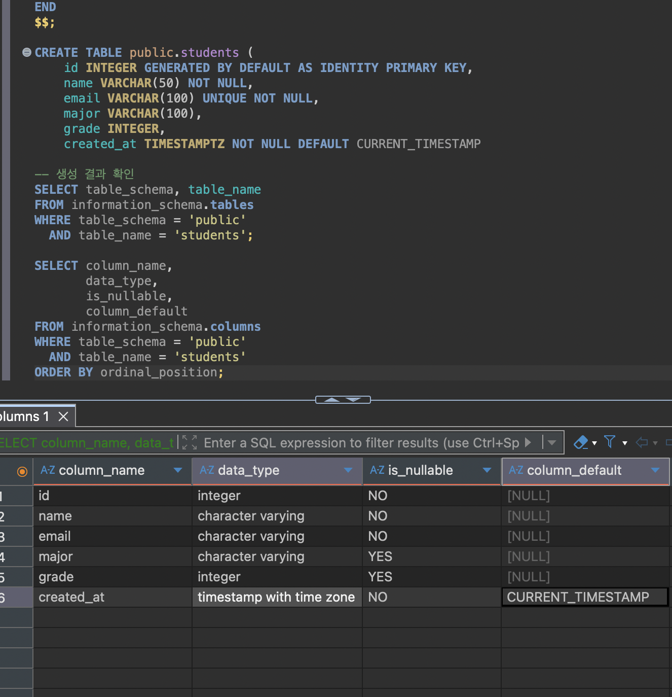
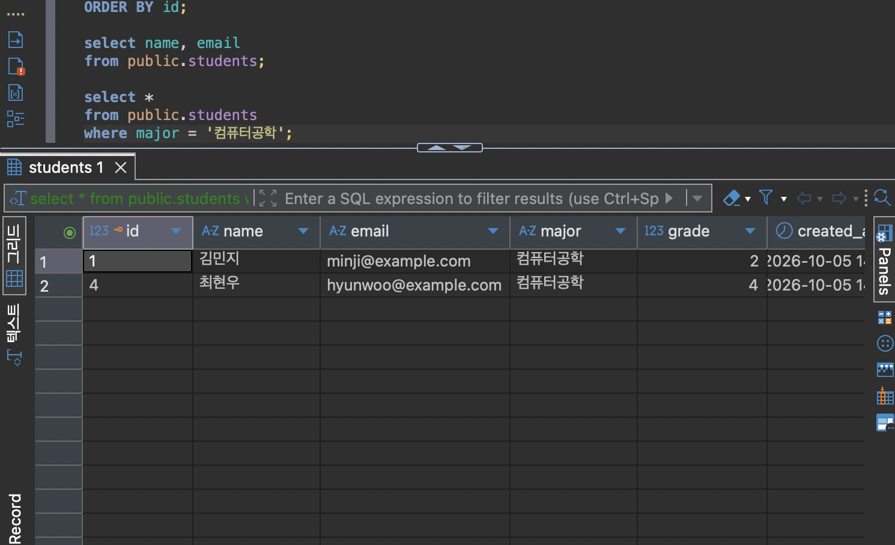

# Chapter 04 확장 실습 답안 템플릿

> **과제:** 관계형 데이터베이스와 SQL 시작하기  
> **사용 방법:** 이 파일을 내려받아 본인의 GitHub 저장소에 `chapter04_answer.md`라는 이름으로 저장한 뒤 실습하면서 바로 작성합니다.  
> **제출 방법:** LMS에는 파일을 직접 업로드하지 않고, **본인 GitHub 저장소의 `chapter04_answer.md` 파일 URL**을 제출합니다.

---

## 제출 전 주의

이 파일과 캡처 화면에는 실제 비밀번호, 전체 DB 접속 URL, API Key, 개인정보를 기록하지 않습니다.

```text
GitHub 계정 또는 별칭: postgres
과제 작성일: 2026-10-05
사용한 AI 도구: ChatGPT
```

---

# 1. 실습 환경과 시작 상태 확인

다음을 실행합니다.

```sql
SELECT current_database();
SELECT current_user;
SELECT current_schema();
SHOW search_path;
SHOW transaction_read_only;
```

| 확인 항목 | 실제 결과 | 의미 |
| --- | --- | --- |
| current_database() | ai_database_book | sql의 데이터베이스 중 ai_database_book 사용 |
| current_user | postgres | 현재 사용자 이름 |
| current_schema() | public | 테이블만 입력하면 기본으로 뜨는 것 |
| search_path | public, "$user" | 테이블을 찾는 순서가 public 다음 user이다  |
| transaction_read_only | off | 변경 및 수정 가능하다 |

- [V] 현재 DB가 `ai_database_book`이다.
- [V] 변경 가능한 연결인지 확인했다.
- [V] 실행할 SQL 범위를 확인했다.
- [V] Auto-commit 상태를 확인했다.

### 변경 SQL을 실행하기 전에 현재 DB와 실행 범위를 확인해야 하는 이유

```text
변경 SQL의 경우 데이터를 수정이나 삭제할 수 있기 때문에 현재 DB를 먼저 확인하여 얼마나 영향을 받는지 실행 범위를 확인해야 한다. 
```

---

# 2. `public.students` 구조 생성

## 2-1. 실행 전 예상

```text
테이블 이름: students
한 행의 의미: 학생 한 명
예상 행 수: 6개
기본키: id
필수 열: name, email, time
중복을 막는 열: email
자동 생성 열: id
```

## 2-2. 실행 파일

```text
code/chapter04/01_create_students.sql
```

## 2-3. 실행 후 확인

```text
테이블 생성 성공 여부: Y
실제 행 수: 6
DBeaver에서 확인한 위치: Public
```

### 각 열의 역할

| 열 | 타입 | NULL 가능? | 역할 |
| --- | --- | --- | --- |
| id | integer | N | 구분 |
| name | character varying | N | 이름 알려줌 |
| email | character varying | N | 중복 방지 |
| major | character varying | Y | 전공 알려줌 |
| grade | integer | Y | 성적 표시 |
| created_at | timestamp with time zone | N | 생성 시간 표시 |

### `id`를 학번이나 학생 수로 해석하면 안 되는 이유

```text
구별하기 위해서 붙이는 번호이기 때문에 중간에 학생을 삭제하거나 추가하면 번호가 건너 뛸 수 있기 때문에 학생 수로 파악하면 안되며, 학번이라는 고유의 번호가 아니라 임의로 지정한 것이다.
```

### 증거 화면

권장 경로:

```text
assignments/chapter04/images/step02_table.png
```




---

# 3. 샘플 데이터 6명 입력

## 3-1. 실행 전 예상

```text
현재 행 수: 0
실행 후 예상 행 수: 6
예상되는 NULL 포함 학생: 1
```

## 3-2. 실행 파일

```text
code/chapter04/02_insert_students.sql
```

## 3-3. 실제 결과

```text
실제 행 수: 6
이준호 grade: 3
박서연 존재 여부: Y
윤서진 major: Null
윤서진 grade: Null
```

### 예상과 실제 비교

```text
예상과 실제가 일치했는가: Y
다르다면 이유:같음
```

### `created_at` 값이 여러 행에서 같을 수 있는 이유

```text
자동으로 입력된 시간을 넣기 때문에 동시에 넣으면 같은 시간에 생성되기 때문에 동일한 created at이 생성됨
```

---

# 4. SELECT 복습과 결과 검증

각 문제는 **SQL 실행 전에 예상 행 수를 먼저 작성**합니다.

| 번호 | 조회 문제 | 예상 행 수 | 실제 행 수 | 일치? | 다르면 이유 |
| ---: | --- | ---: | ---: | --- | --- |
| 1 | 전체 학생 | 6 | 6 | 일치 | 일치 |
| 2 | 이름·이메일만 조회 | 1 | 6 | 6 | 특정 이름, 이메일만 검색한 것이 아니니까 |
| 3 | 특정 전공 | 1~2 | 2 | 부분 일치 | 전공에 따라서 속한 행 달라짐 |
| 4 | 특정 학년 이상 | 2 | 2 | 일치 | 일치 |
| 5 | 두 전공 중 하나 | 3 | 3 | 일치 | 일치 |
| 6 | `grade IS NULL` | 1 | 1 | 일치 | 일치 |
| 7 | 전공 `DISTINCT` | 4 | 5 | 일치 | Null도 전공으로 분류됨 |
| 8 | 정렬 후 상위 3명 | 3 | 3 | 일치 | 일치 |

## 4-1. 내가 직접 작성한 SQL 2개

```sql
-- SQL 1
select name, email
from public.students;
```

```text
이 SQL의 한 행 의미: 한 학생의 이름과 이메일
예상 행 수: 1
실제 행 수: 6
```

```sql
-- SQL 2
select *
from public.students
where major = '컴퓨터공학';
```

```text
이 SQL의 한 행 의미: 한 학생의 정보
예상 행 수: 2
실제 행 수: 2
```

## 4-2. `= NULL` 대신 `IS NULL`을 사용하는 이유

```text
grade=NULL을 사용하면 grade에 NULL이라고 되어 있는 칸을 찾기 때문에 나오지 않음. is NULL이라고 해야 빈칸인 애를 찾음
```

## 4-3. `ORDER BY` 없이 결과 순서를 믿으면 안 되는 이유

```text
순서가 임의로 정렬되어 있을 수 있기 때문에
```

## 4-4. `DISTINCT`가 원본 데이터를 삭제하는 기능인가요?

```text
아니다, 해당 부분만 따로 검색하는 것이지 수정하거나 삭제하는 기능이 아니다. 
```

### 증거 화면

권장 경로:

```text
assignments/chapter04/images/step04_select.png
```



---

# 5. 내 가상 학생 2명 추가

실명·실제 이메일 대신 가상 데이터를 사용합니다.

## 5-1. 실행 전 계획

```text
학생 A
이름: 정우영
이메일: woo22@gmail.com
전공: 경영학
학년: 4

학생 B
이름: 최산
이메일: mountain@gmail.com
전공: 컴퓨터공학
학년 또는 NULL: NULL

현재 행 수: 6
추가 후 예상 행 수:8
```

## 5-2. 내가 실행한 INSERT

```sql
INSERT INTO public.students (name, email, major, grade)
values
	('정우영', 'woo22@gmail.com', '경영학', 4),
	('최산', 'mountain@gmail.com', '컴퓨터공학',NULL)
RETURNING id, name, email, major, grade;
```

## 5-3. 실제 결과

```text
RETURNING 또는 확인 SELECT 결과: 입력한 값이 모두 잘 들어감
실제 전체 행 수: 8
예상과 일치 여부: Y
```

### 내가 일부 값을 NULL로 둔 이유 또는 NULL을 사용하지 않은 이유

```text
grade는 빈칸으로 둬도 되기 때문에
```

---

# 6. 안전한 UPDATE

내가 추가한 가상 학생 한 명만 수정합니다.

## 6-1. 먼저 대상 확인 SELECT

```sql
SELECT *
FROM public.students
WHERE email = 'woo22@gmail.com';
```

```text
예상 대상 행 수: 1
실제 대상 행 수: 1
```

## 6-2. UPDATE

```sql

```

```text
예상 영향 행 수:
실제 영향 행 수:
RETURNING 결과:
```

## 6-3. UPDATE 후 재조회

```sql
UPDATE public.students
SET grade = 3
WHERE email = 'woo22@gmail.com'
RETURNING id, name, email, grade;
```

### `WHERE` 없는 UPDATE를 실행하면 위험한 이유

```text
전체 데이터를 변경할 가능성이 있으므로
```

### 증거 화면

권장 경로:

```text
assignments/chapter04/images/step06_update.png
```


---

# 7. 안전한 DELETE

내가 추가한 가상 학생 한 명을 삭제합니다.

## 7-1. 삭제 전 확인

```sql
select *
from public.students
where email = 'woo22@gmail.com';
```

```text
예상 대상 행 수: 1
실제 대상 행 수: 1
```

## 7-2. DELETE

```sql
DELETE FROM public.students
WHERE email = 'woo22@gmail.com'
RETURNING id, name, email; 
```

```text
예상 영향 행 수: 1
실제 영향 행 수: 1
RETURNING 결과: 해당 학생 정보 나옴
```

## 7-3. 삭제 후 재조회

```sql
select *
from public.students
where email = 'woo22@gmail.com';
```

```text
삭제 후 같은 조건의 SELECT 결과 행 수: 0 
```

### `DELETE` 성공 메시지만 보고 끝내지 않고 다시 SELECT해야 하는 이유

```text
실제로는 삭제가 안되었을 수도 있기 때문에.
```

---

# 8. 본문 기준 UPDATE·DELETE 상태 검증

`04_update_delete_students.sql`을 본문 시작 상태에서 실행했다면 다음을 확인합니다.

```text
최종 학생 수: 5
이준호 grade: 4
박서연 존재 여부: N
```

본문 기준 기대 상태와 비교합니다.

```text
학생 수 = 5
이준호 grade = 4
박서연 = 0행
```

### 내 실제 결과가 기준과 다르다면 원인

```text
같음
```

---

# 9. 의도한 실패 2개 관찰

> 실패 테스트는 데이터베이스 규칙이 실제로 데이터를 보호하는지 확인하는 실험입니다.

## 9-1. 중복 이메일 `UNIQUE` 오류

내가 사용한 SQL:

```sql
INSERT INTO public.students (name, email, major, grade)
VALUES ('중복테스트', 'minji@example.com', '테스트전공', 1);
```

```text
오류 메시지 핵심 단서: already exists
왜 실패해야 맞는가: 이메일은 unique라고 했는데 이미 있는 이메일이라서
어떤 규칙이 작동했는가: unique
실패 후 기존 데이터가 어떻게 유지되었는가: 기존 데이터는 유지됨
```

## 9-2. 이름 `NULL` 입력 `NOT NULL` 오류

내가 사용한 SQL:

```sql
INSERT INTO public.students (name, email, major, grade)
VALUES (NULL, 'null_name_test@example.com', '테스트전공', 1);
```

```text
오류 메시지 핵심 단서: null value
왜 실패해야 맞는가: name은 not null이라고 정했기 때문에
어떤 규칙이 작동했는가: not null
```

### 실패한 INSERT 뒤 자동 생성 `id` 번호에 빈 구간이 생길 수 있어도 문제라고 단정할 수 없는 이유

```text
id는 자동으로 생성된 것이기 때문에 삭제, 추가 하는 과정에서 빈 구간이 생길 수 있음
```

### 증거 화면

권장 경로:

```text
assignments/chapter04/images/step09_constraint_error.png
```


---

# 10. `verify_students.sql`로 최종 상태 확인

실행 파일:

```text
code/chapter04/verify_students.sql
```

```text
현재 전체 학생 수: 5
NULL 개수: 1
이준호 grade: 4
박서연 존재 여부: N
현재 데이터 상태에서 예상과 다른 부분: N
```

### 검증 SQL을 따로 두면 좋은 이유

```text
단순히 오류 없이 실행했다는 사실과 최종 구조와 데이터가 기대 상태와 맞다는 것은 다르기 때문에
```

---

# 11. AI를 SQL 작성자가 아니라 검토자로 활용

먼저 본인이 SQL을 작성한 뒤 AI에게 검토를 요청합니다.

## 11-1. 내가 작성한 SQL

```sql
Delete from public.students
where name = '최산'
```

## 11-2. AI에게 전달한 핵심 요청

```text
나는 PostgreSQL 초보자입니다.
아래 SQL을 바로 다시 작성하지 말고 먼저 안전성을 검토해 주세요.
다음 순서로 답해 주세요.
1. 이 SQL이 영향을 줄 것으로 예상되는 행
2. WHERE 조건이 너무 넓거나 모호하지 않은지
3. NULL 처리에서 주의할 점
4. 실행 전에 같은 조건으로 확인할 SELECT
5. 실행 후 결과를 확인할 SELECT
6. 내가 놓친 위험이 있다면 질문 형태로 제시
```

## 11-3. AI 검토 결과

| AI 제안 | 수용 / 수정 / 거절 | 실제 검증 결과 | 나의 이유 |
| --- | --- | --- | --- |
| id처럼 각 학생을 고유하게 구별하는 값으로 삭제 대상을 먼저 확인할 수 있나요? | 수용 | 고유 값을 확인 가능 | 고유값으로 삭제하는 것이 더 안전 |
| '최산'이라는 이름을 가진 모든 행을 삭제하려는 것이 맞나요? | 수용 | 실제 최산의 행이 삭제 | 원하는 시행 결과 |
| 이 학생을 참조하는 다른 테이블의 외래 키가 있다면, 삭제가 거부되거나 관련 데이터에 영향을 줄 수 있나요? | 거절 | 삭제됨 |  |

### AI가 예상한 영향 행 수와 실제 결과가 같았나요?

```text
Y
```

### AI 답변을 실행 전에 검토해야 하는 이유

```text
정확히 내가 원하는 방향으로 이루어졌는지 확인하기 위해서 
```

---

# 12. 내 서비스 테이블 하나 확장 설계

Chapter 01~03에서 정한 개인 서비스에서 **테이블 하나**를 선택합니다.

```text
서비스 이름: 경영대 우산 대여 서비스
테이블 이름: rental_students
한 행의 의미: 우산을 대여한 학생의 
```

| 열 이름 | 저장할 값 | 타입 후보 | NULL 가능? | UNIQUE 후보? | 이유 |
| --- | --- | --- | --- | --- | --- |
| id | 자동 생성 | integer | N | N | 자동 생성(중복 불가) |
| 이름 | 이름 | character varying | N | Y | 동명이인 가능 |
| 학번 | 서울대 학번 | integer | N | N | 고유 번호로 판별 |
| 학과 | 소속 주전공 | character varying | Y | Y | 동일 학과 가능 |
| 대여 날짜 | 대여한 날짜 | created time | N | N | 같은 날짜에 대여 가능 |
| 반납 날짜 | 반납 필수 날짜 | time | N | N | 같은 날짜에 반납 예정 가능 |
| 반납 여부 | 반납, 연체, 보류 | character varying | N | N | 반납 여부를 통해서 연체 table로 연결 |

```text
PK 후보: id
업무 식별자 후보: 학번
아직 미확정인 규칙: 연체 중인 경우 얼마나 대여를 불가하게 만들지, 주전공을 제외한 다른 전공도 연체 가능한지
```

## 선택: CREATE TABLE 초안

> 아직 확정되지 않은 업무 규칙은 억지로 제약조건으로 만들지 않습니다.

```sql
CREATE TABLE rental_students (
    rental_student_id INTEGER GENERATED ALWAYS AS IDENTITY PRIMARY KEY,
    student_number VARCHAR(9) NOT NULL UNIQUE,
    student_name VARCHAR(10) NOT NULL,
    major VARCHAR(10),
    registered_on DATE NOT NULL
);
```

### AI에게 검토받은 뒤 수정한 부분

```text
CREATE TABLE rental_students (
    rental_student_id INTEGER GENERATED ALWAYS AS IDENTITY PRIMARY KEY,
    student_number VARCHAR(9) NOT NULL UNIQUE,
    student_name VARCHAR(20) NOT NULL,
    major VARCHAR(50),
    registered_on DATE NOT NULL
);

바이오시스템공학융합대학 등 학과명이 긴 경우가 존재하기 때문에 넉넉하게 전공 글자수를 최대 50자로 변경
```

---

# 13. 최종 성찰

아래 문장은 본인의 말로 작성합니다.

```text
1. SQL 실행 성공과 올바른 대상 선택이 다른 이유는
   실행은 문장이 잘 실행되었다는 뜻이고 대상 선택은 원하는 대로 실행이 되었다는 뜻이다.

2. UPDATE와 DELETE 전에 SELECT를 먼저 해야 하는 이유는
   그래야 정확하게 실행 여부, 혹은 오류가 난다면 그 이유를 설명할 수 있기 때문이다.

3. 영향받은 행 수를 확인해야 하는 이유는
   다른 행이 영향 받는 다면 원하는 구조가 안나올 수 도 있기 때문이다.

4. UNIQUE 또는 NOT NULL 오류를 '보호 장치가 정상 동작한 결과'라고 볼 수 있는 이유는
   이미 설정해둔 초기값에 부합하는 지 여부를 보는 것이기 때문이다.

5. AI가 SQL을 만들어 주더라도 내가 반드시 확인해야 하는 것은
   전과 후를 직접 실행해보는 것 이다.
```

---

# 14. 제출 체크리스트

- [V] `chapter04_answer.md`를 본인 저장소에 만들었다.
- [V] 현재 DB와 실행 환경을 확인했다.
- [V] `public.students`를 생성했다.
- [V] 샘플 6명 입력 결과를 검증했다.
- [V] SELECT 문제에서 실행 전 예상 행 수를 작성했다.
- [V] 가상 학생 2명을 추가했다.
- [V] UPDATE 전후를 SELECT로 확인했다.
- [V] DELETE 전후를 SELECT로 확인했다.
- [V] UNIQUE 오류를 관찰했다.
- [V] NOT NULL 오류를 관찰했다.
- [V] `verify_students.sql`로 상태를 확인했다.
- [V] AI 제안을 실제 SQL 결과와 비교했다.
- [V] 개인 서비스 테이블 하나를 확장 설계했다.
- [V] 핵심 캡처는 3~4장 정도로 제한했다.
- [V] 비밀번호·개인정보가 캡처에 없다.
- [V] Markdown 이미지가 GitHub 웹 화면에서 정상 표시된다.
- [V] commit/push를 완료했다.

---

# 15. LMS 제출 URL

아래 형식의 **본인 GitHub 파일 URL**을 LMS에 제출합니다.

```text
https://github.com/<본인-GitHub-ID>/<본인-저장소>/blob/main/assignments/chapter04/chapter04_answer.md
```

내 제출 URL:

```text
https://github.com/seohee0233/ai-database-study/blob/main/assignments/chapter04/chapter04_answer_template.md
```

> 교수자 템플릿 URL이나 저장소 메인 URL이 아니라 **작성 완료된 본인 `chapter04_answer.md` 파일 화면 URL**을 제출합니다.
