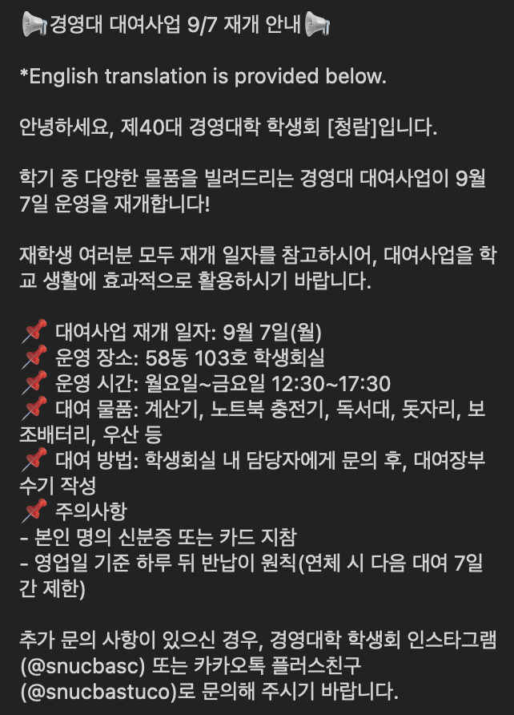
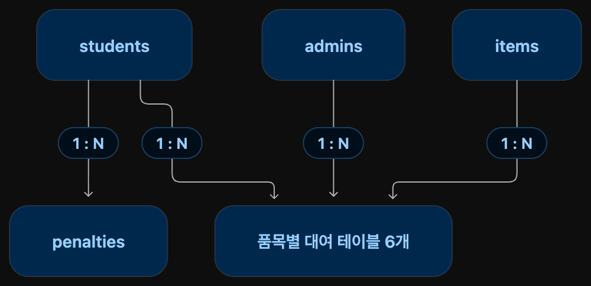

# 경영대 학생회 공용물품 대여 관리 시스템

## 1. 프로젝트명

**경영대 학생회 대여 서비스 관리 시스템**

---

## 2. 프로젝트 주제 및 비즈니스 모델

서울대학교 경영대 학생회가 보유한 공용물품을 학생들에게 대여하고 반납받는 과정을 관리하는 웹 또는 앱 기반 서비스이다.

관리 대상 물품은 다음과 같다.

```
1. 우산
2. 계산기
3. 노트북 충전기
4. 보조배터리
5. 돗자리
6. 독서대
```



학생회는 물품의 대여 가능 여부, 대여자, 반납 예정일, 연체 여부를 데이터베이스로 관리한다. 
학생은 본인의 대여 상태를 확인하고, 관리자는 대여·반납 업무와 연체 제한을 처리한다.

이 프로젝트에서는 별도의 대여료를 두지 않고, 학생회가 운영하는 대여 서비스를 구현하는 것을 목표로 한다.

---

## 3. 해결하고자 하는 문제

### 현재 문제

- 수기로 작성하거나 구글폼만 활용해서 너무 번거롭다.
- 현재 누가 어떤 물품을 빌렸는지 확인하기 어렵다.
- 반납 예정일이 지난 학생을 바로 확인하기 어렵다.
- 자주 반납하는 학생들을 관리하기 어렵다.
- 품목별 대여 횟수, 현재 대여 수, 연체 현황을 통계로 확인하기 어렵다.

이 시스템은 학생, 물품, 대여 기록, 패널티 기록을 연결하여 위 문제를 해결한다.

---

## 4. 주요 사용자

| 사용자 | 주요 역할 |
| --- | --- |
| 학생 | 대여 가능한 물품과 본인의 대여하고 반납 상태를 확인한다. |
| 학생회 관리자 | 학생과 물품을 등록하고, 대여하고반납 처리 및 연체 제한 관리를 수행한다. |

---

## 5. 핵심 업무 규칙

```
1. 학생은 서로 다른 품목을 동시에 하나씩 빌릴 수 있다.  
   예를 들어 우산 한 개와 계산기 한 개를 함께 빌릴 수 있다.

2. 학생은 같은 품목을 동시에 두 개 이상 빌릴 수 없다.  
   예를 들어 계산기 두 개를 동시에 빌릴 수 없다.

3. 같은 실제 물품은 동시에 한 학생에게만 대여할 수 있다.  
   예를 들어 계산기 `C-01`을 학생 A가 대여 중이면 학생 B는 해당 계산기를 빌릴 수 없다.

4. 연체한 학생은 7일 동안 모든 품목을 대여할 수 없다.

5. 반납한 대여 기록과 종료된 패널티 기록은 삭제하지 않고 보관한다. 이를 통해 학생별 대여 이력과 품목별 대여 통계를 확인할 수 있다.
```
---

## 6. 핵심 기능

### 6-1. 대여 학생 관리

- 대여하는 학생 정보 등록
- 학번, 이름, 전공, 학번 포함
- 학생 정보 수정 및 과거 데이터 삭제 가능
- 학생별 현재 대여 현황 및 과거 대여 이력 조회

### 6-2. 관리자 관리

- 관리자 정보 등록 및 수정
- 관리자별 담당 요일과 담당 시간 등록
- 대여 요청 시간에 맞는 관리자 자동 배정
- 대여와 반납을 처리한 관리자 확인

### 6-3. 물품 관리

- 실제 물품을 번호를 부여하여 입력
  예: 우산 `U-01`, 계산기 `C-01`, 보조배터리 `PB-01`
- 물품 종류, 물품 번호, 상태 관리
- 상태 조회: 대여 가능/대여 중/고장 및 분실
- 품목별 대여 가능 물품 검색
- 자주 대여되는 물품 관리를 통해서 예산 효율화

### 6-4. 대여 처리

대여 요청 시 아래 내용을 확인한다.

1. 학생에게 아직 종료되지 않은 연체 패널티가 있는지 확인한다.
2. 학생이 같은 품목을 현재 대여 중인지 확인한다.
3. 선택한 실제 물품이 다른 학생에게 대여 중인지 확인한다.
4. 대여 요청 시간에 담당하는 관리자를 자동 배정한다.
5. 조건을 모두 만족하면 대여 기록을 생성하고 물품 상태를 `대여 중`으로 변경한다.

### 6-5. 반납 처리

- 실제 반납 일시를 대여 기록의 `returned_at`에 입력한다.
- 물품 상태를 `대여 가능`으로 변경한다.
- 반납 예정일보다 늦게 반납했는지 확인한다.
- 연체한 경우 패널티 기록을 생성한다.

반납한 기록은 삭제하지 않는다. 예를 들어 계산기 `C-01`을 반납한 뒤 다시 빌리면, 기존 기록은 유지하고 새 대여 기록을 추가한다.

### 6-6. 패널티 관리

- 연체 학생에게 7일간의 대여 제한을 적용한다.
- 패널티 시작일과 종료일을 저장한다.
- 종료일이 지나면 학생은 다시 대여할 수 있다.
- 과거 패널티 기록은 연체 통계와 이력 조회를 위해 유지한다.

### 6-7. 검색, 필터, 정렬, 통계

- 학번 또는 이름으로 학생 검색
- 품목 종류별 물품 검색
- 대여 가능 물품만 필터링
- 현재 대여 중인 물품만 조회
- 반납 예정일이 임박한 대여 기록 조회
- 연체 중인 학생 조회
- 품목별 대여 횟수 집계
- 월별 대여 건수 집계
- 학생별 연체 횟수 집계
- 대여 횟수가 많은 물품 순으로 정렬

---

## 7. 예상 테이블 구성

총 10개의 테이블을 구성한다.

| 번호 | 테이블명 | 한 행의 의미 |
| ---: | --- | --- |
| 1 | `students` | 서비스에 등록된 학생 한 명의 정보 |
| 2 | `admins` | 대여 업무를 담당하는 관리자 한 명의 정보 |
| 3 | `items` | 실제 대여 가능한 물품 한 개의 정보 |
| 4 | `umbrella_rentals` | 학생 한 명의 우산 대여 기록 한 건 |
| 5 | `calculator_rentals` | 학생 한 명의 계산기 대여 기록 한 건 |
| 6 | `laptop_charger_rentals` | 학생 한 명의 노트북 충전기 대여 기록 한 건 |
| 7 | `power_bank_rentals` | 학생 한 명의 보조배터리 대여 기록 한 건 |
| 8 | `mat_rentals` | 학생 한 명의 돗자리 대여 기록 한 건 |
| 9 | `reading_stand_rentals` | 학생 한 명의 독서대 대여 기록 한 건 |
| 10 | `penalties` | 학생에게 적용된 대여 제한 기록 한 건 |

---

## 8. 테이블별 데이터 구조

### 8-1. `students`

학생의 기본 정보를 관리한다.

| 열 이름 | 설명 | 키 또는 제약조건 후보 |
| --- | --- | --- |
| `student_id` | 데이터베이스 내부 학생 번호 | PK |
| `student_number` | 서울대학교 학번 | UNIQUE, NOT NULL |
| `student_name` | 학생 이름 | NOT NULL |
| `major` | 소속 학과 또는 전공 | - |

`student_id`는 데이터베이스에서 학생 행을 구분하기 위한 내부 식별자이다. (PK)
`student_number`는 실제 학교 업무에서 학생을 구분하기 위한 업무 식별자이다. (FK)

---

### 8-2. `admins`

대여·반납 업무를 처리하는 학생회 관리자 정보를 관리한다.

| 열 이름 | 설명 | 키 또는 제약조건 후보 |
| --- | --- | --- |
| `admin_id` | 관리자 내부 번호 | PK |
| `admin_name` | 관리자 이름 | NOT NULL |
| `admin_team` | 소속 학생회 부서 | NOT NULL |
| `admin_num` | 관리자 학번 | UNIQUE, NOTNULL |
| `duty_day` | 담당 요일 |  |
| `duty_start_time` | 담당 시작 시간 |  |
| `duty_end_time` | 담당 종료 시간 |  |

대여 요청이 들어온 시간과 담당 요일/시간을 넣어두고 담당 관리자를 자동 배정한다.

---

### 8-3. `items`

실제 물품을 하나씩 관리한다.

| 열 이름 | 설명 | 키 또는 제약조건 후보 |
| --- | --- | ---|
| `item_id` | 물품 내부 번호 | PK |
| `item_type` | 물품 종류 | 예: umbrella, calculator |
| `item_number` | 물품 번호 | 예: U-01, C-01 |
| `item_status` | 현재 물품 상태 | 대여 가능/대여 중/대여 불가 등 |

예시 데이터는 다음과 같다.

| item_id | item_type | item_number | item_status |
| ---: | --- | --- | --- |
| 1 | umbrella | U-01 | 대여 가능 |
| 2 | calculator | C-01 | 대여 중 |
| 3 | power_bank | PB-01 | 대여 불가 |

---

### 8-4. 품목별 대여 테이블

아래 여섯 테이블은 같은 열 구조를 사용한다.

```text
umbrella_rentals
calculator_rentals
laptop_charger_rentals
power_bank_rentals
mat_rentals
reading_stand_rentals
```

각 대여 테이블은 다음 열을 가진다.

| 열 이름 | 설명 | 키 또는 제약조건 후보 |
| --- | --- | --- |
| `rental_id` | 대여 기록 내부 번호 | PK |
| `student_id` | 대여한 학생 번호 | FK → `students.student_id` |
| `item_id` | 대여한 실제 물품 번호 | FK → `items.item_id` |
| `admin_id` | 대여를 처리한 관리자 번호 | FK → `admins.admin_id` |
| `rented_at` | 실제 대여 일시 | NOT NULL |
| `due_at` | 반납 예정 일시 | NOT NULL |
| `returned_at` | 실제 반납 일시 | 반납 전에는 NULL 가능 |

예를 들어 `calculator_rentals`의 한 행은 다음 의미를 가진다.

```text
학생 한 명이 계산기 한 개를 빌린 한 건의 기록
```

반납 전에는 `returned_at`이 `NULL`이다. 반납 후에는 실제 반납 일시를 입력한다.

| rental_id | student_id | item_id | rented_at | due_at | returned_at |
| ---: | ---: | ---: | --- | --- | --- |
| 1 | 1 | 2 | 2026-10-09 13:00 | 2026-10-10 18:00 | NULL |
| 2 | 1 | 5 | 2026-09-15 13:00 | 2026-09-16 18:00 | 2026-09-16 17:30 |

---

### 8-5. `penalties`

연체로 인해 학생에게 적용된 대여 제한을 관리한다.

| 열 이름 | 설명 | 키 또는 제약조건 후보 |
| --- | --- | --- |
| `penalty_id` | 패널티 기록 번호 | PK |
| `student_id` | 제한 대상 학생 번호 | FK → `students.student_id` |
| `student_name` | 제한 대상 학생 이름 | - |
| `student_major` | 제한 대상 학생 전공 | - |
| `student_num` | 제한 대상 학생 학번 | NOT NULL |
| `late_item_type` | 연체한 물품 종류 | 예: umbrella |
| `restriction_start_date` | 제한 시작일 | NOT NULL |
| `restriction_end_date` | 제한 종료일 | NOT NULL |

대여 전에는 다음 조건을 확인한다.

```text
오늘 날짜보다 종료일이 같거나 늦은 패널티가 있는가?
제한 시작일이 대여 종료 예정 날짜에서 시작할 것인지, 아니면 반납한 이후로 시작될 것인지.
```

해당 패널티가 있으면 학생은 어떤 품목도 대여할 수 없다.

---

## 9. 테이블 관계

```text
students 1 : N umbrella_rentals
students 1 : N calculator_rentals
students 1 : N laptop_charger_rentals
students 1 : N power_bank_rentals
students 1 : N mat_rentals
students 1 : N reading_stand_rentals
students 1 : N penalties

admins 1 : N 각 품목별 대여 테이블

items 1 : N 각 품목별 대여 테이블
```



학생 한 명은 시간차를 두고 여러 번 물품을 빌릴 수 있으므로, 학생과 각 대여 테이블은 1:N 관계이다.

물품 한 개도 반납된 뒤 다른 학생에게 여러 번 대여될 수 있으므로, 물품과 각 대여 테이블도 1:N 관계이다.

관리자 한 명은 담당 시간 동안 여러 건의 대여·반납 업무를 처리할 수 있으므로, 관리자와 각 대여 테이블도 1:N 관계이다.

---

## 10. 주요 SQL 활용 계획

### CRUD

| 구분 | 구현 예시 |
| --- | --- |
| Create | 학생 등록, 물품 등록, 대여 기록 생성, 패널티 기록 생성 |
| Read | 현재 대여 현황, 학생별 대여 이력, 연체 학생 조회 |
| Update | 반납 일시 입력, 물품 상태 변경, 관리자 담당 시간 수정 |
| Delete | 잘못 등록한 학생·물품·테스트 데이터 삭제 |

완료된 대여 기록과 종료된 패널티 기록은 통계와 이력 조회를 위해 유지한다.

### JOIN

학생 이름, 물품 번호, 담당 관리자, 대여 일시를 한 번에 확인한다.

```text
학생 테이블
+ 품목별 대여 테이블
+ 물품 테이블
+ 관리자 테이블
```

예시 조회 결과:

| 학생 이름 | 학번 | 물품 번호 | 담당 관리자 | 대여 일시 | 반납 상태 |
| --- | --- | --- | --- | --- | --- |
| 박서희 | 2021-11710 | C-01 | 김학생 | 2026-10-09 13:00 | 대여 중 |

### 집계

- 품목별 총 대여 횟수
- 월별 대여 건수
- 현재 대여 중인 물품 수
- 학생별 연체 횟수
- 가장 많이 대여된 물품 순위

### 서브쿼리

- 현재 연체 제한이 적용 중인 학생 조회
- 한 번이라도 연체한 학생 조회
- 현재 대여 가능한 물품 조회
- 특정 학생이 현재 같은 품목을 빌리고 있는지 확인

---

## 11. 샘플 데이터 계획

개인정보 대신 가상의 데이터를 사용한다.

| 데이터 | 예시 수량 |
| --- | ---: |
| 학생 | 10명 이상 |
| 관리자 | 3명 이상 |
| 우산 | 5개 이상 |
| 계산기 | 5개 이상 |
| 노트북 충전기 | 3개 이상 |
| 보조배터리 | 3개 이상 |
| 돗자리 | 3개 이상 |
| 독서대 | 3개 이상 |
| 대여 기록 | 30건 이상 |
| 패널티 기록 | 3건 이상 |

대여 중인 기록, 반납 완료 기록, 연체 기록을 모두 포함해 기능과 SQL 결과를 확인한다.

---

## 12. 향후 구현 계획

1. 테이블별 열과 데이터 타입을 확정한다.
2. PostgreSQL에서 테이블, PK, FK, 제약조건을 생성한다.
3. 가상의 샘플 데이터를 입력한다.
4. 대여 전 조건 확인 로직을 구현한다.
5. 대여·반납·패널티 CRUD 기능을 구현한다.
6. JOIN, 집계, 서브쿼리를 이용한 조회 기능을 구현한다.
7. (가능하면) 바이브 코딩으로 데이터베이스와 연결되는 앱 화면을 만든다.
